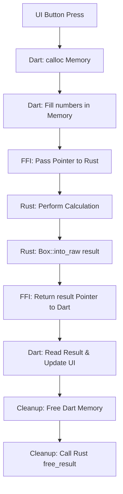

# 📘 Master Guide: Rust-Flutter FFI & Memory Mapping Strategy
### Project 01 — Calculator Engine Deep-Dive

এই ডকুমেন্টটি আপনার রাস্ট এবং ফ্লাটারের মধ্যে **Memory Mapping** এবং **FFI (Foreign Function Interface)** এর গভীরতর জ্ঞান অর্জনের জন্য তৈরি করা হয়েছে। এখানে প্রতিটি পার্ট বিস্তারিতভাবে ব্যাখ্যা করা হয়েছে।

---

## 🏗️ Part 1: The Core Concept | মেমোরি ম্যাপিংয়ের মূল দর্শন

### ১.১ কেন মেমোরি ম্যাপিং প্রয়োজন?
ডার্ট (Dart) এবং রাস্ট (Rust) সম্পূর্ণ আলাদা দুটি ল্যাঙ্গুয়েজ। তাদের নিজস্ব **Heap Memory** এবং **Garbage Collector** (ডার্টের ক্ষেত্রে) আলাদা। 
- ডার্ট জানে না রাস্টের মেমোরি কোথায়।
- রাস্ট জানে না ডার্টের ভেরিয়েবল কোথায়। 

এদের মধ্যে কথা বলার একমাত্র মাধ্যম হলো **Native Memory (C-Heap)**। এটি ল্যাপটপ বা ফোনের এমন একটি মেমোরি এরিয়া যা পৃথিবীর সব ল্যাঙ্গুয়েজ চিনতে পারে। FFI মূলত এই কমন মেমোরি এরিয়া ব্যবহার করে ডাটা আদান-প্রদান করে।

---

## 🦀 Part 2: Rust Implementation | রাস্টের গভীর কারিগরি

রাস্ট এখানে একটি **"Service Provider"** হিসেবে কাজ করে। সে অ্যান্ড্রয়েডের জন্য একটি বাইনারি (`.so`) ফাইল তৈরি করে যেখানে ফাংশনগুলো লুকানো থাকে।

### ২.১ `#[repr(C)]` — মেমোরি লেআউট ফিক্সিং
রাস্ট সাধারণত মেমোরি বাঁচানোর জন্য স্ট্রাকচারের ভেতরের ডাটার ক্রম (Order) বদলে দেয়। কিন্তু বাইরের কেউ (FFI) যখন ডাটা পড়তে আসে, তখন সে কনফিউজড হয়ে যায়। 
- **সমাধান:** `#[repr(C)]` ব্যবহার করলে রাস্টকে বাধ্য করা হয় যেন সে ডাটাগুলো ঠিক সেভাবেই সাজায় যেভাবে সি-ল্যাঙ্গুয়েজ সাজাতো। এর ফলে ডার্ট সহজেই বুঝতে পারে কত নম্বর বাইট-এ কোন ডাটা আছে।

### ২.২ `Box::into_raw` — ওনারশিপ ত্যাগ করা
রাস্টের একটি শক্তিশালী বৈশিষ্ট্য হলো **Ownership**। কোনো ফাংশন শেষ হলে রাস্ট সেই ডাটা ডিলিট করে দেয়। কিন্তু আমরা যখন রেজাল্টটি ফ্লাটারকে পাঠাতে চাই, তখন যদি রাস্ট সেটা ডিলিট করে দেয়, তবে ফ্লাটার কিছুই পাবে না।
- **সমাধান:** `Box::into_raw(Box::new(result))` ব্যবহার করা হয়। এটি রাস্টকে বলে— "এই ডাটাটি তুমি আর ডিলিট করো না, আমি এটি মেমোরিতে রেখে দিলাম এবং এর চাবি (Pointer) অন্য কাউকে দিচ্ছি।" এই অবস্থাকে বলা হয় **Leaking memory intentionally to the FFI**.

### ২.৩ `#[unsafe(no_mangle)]` এবং `extern "C"`
- **No Mangle:** রাস্ট কম্পাইলার যেন আপনার ফাংশনের নাম (`calc_add`) বদলে না দেয়। না হলে ডার্ট একে খুঁজে পাবে না।
- **extern "C":** এটি ফাংশনকে সি-কলিং প্রটোকলে রূপান্তর করে, যা ইউনিভার্সাল ল্যাঙ্গুয়েজ হিসেবে পরিচিত।

---

## 📱 Part 3: Flutter / Dart Bridge | ফ্লাটারের FFI যাদু

ফ্লাটার এখানে **"Consumer"** হিসেবে কাজ করে। সে রাস্ট থেকে পাওয়া পয়েন্টার (Pointer) ব্যবহার করে ডাটা উদ্ধার করে।

### ৩.১ `DynamicLibrary.open` — গেটওয়ে খোলা
এটি ফোনের ফাইল সিস্টেম থেকে আপনার তৈরি করা `.so` ফাইলটিকে মেমোরিতে রান করাই যা ফ্লাটার অ্যাপের একটি পার্ট হয়ে যায়। এটি ছাড়া রাস্টের কোড কল করা অসম্ভব।

### ৩.২ `calloc` — ডার্ট থেকে রাস্টকে ডাটা পাঠানো
ডার্টের `List<double>` সরাসরি রাস্টকে দেওয়া যায় না। 
- আমরা `calloc` ব্যবহার করে সরাসরি ফোনের র‌্যামে (RAM) একটি স্পেস বুক করি। 
- সেখানে ডার্টের ভ্যালুগুলো কপি করি। 
- তারপর সেই স্পেসের এড্রেসটি রাস্টকে পাঠাই। 
রাস্ট তখন ওই এড্রেসে গিয়ে ডাটা পড়ে নেয়।

### ৩.৩ `NativeFunction` বনাম `Function`
FFI-তে দুটি টাইপ থাকে:
1.  **NativeFunction (Raw):** এটি রাস্টের ফাংশনের সিগনেচার যা ডার্ট সরাসরি কল করতে পারে না।
2.  **asFunction (Dart Callable):** এটি আসলে সেই যাদু যা ওই রাস্টের এড্রেসটিকে একটি সাধারণ ডার্ট মেথডে রূপান্তর করে দেয়।

---

## 🔄 Part 4: The Pointer Sharing Lifecycle | পয়েন্টার শেয়ারিং জীবনচক্র

একটি ক্যালকুলেশন যখন হয়, তখন পর্দার আড়ালে এই ৫টি ধাপ ঘটে:

১. **Allocation (Dart):** ডার্ট `calloc` দিয়ে মেমোরি অ্যালোকেট করে এবং ৫.০, ১০.০ ভ্যালুগুলো সেখানে লিখে রাখে। 
২. **The Call:** ডার্ট ওই মেমোরি এড্রেস এবং লেন্থ রাস্ট ফাংশনে পাঠায়। 
৩. **Rust Reading:** রাস্ট `slice::from_raw_parts` ব্যবহার করে ওই এড্রেস থেকে ডাটাগুলো কপি না করে সরাসরি পড়ে ফেলে (Zero-copy optimization)। 
৪. **Rust Allocation:** রাস্ট হিসাব করে (১৫.০) এবং সেটি অন্য একটি নতুন মেমোরি এড্রেসে রেখে দেয় (`Box::into_raw`) এবং সেই এড্রেসটি ফ্লাটারকে ফেরত দেয়।
৫. **Dart Retrieval:** ফ্লাটার ওই এড্রেস থেকে রেজাল্ট পড়ে এবং ইউজারকে স্ক্রিনে দেখায়।

---

## 🧹 Part 5: Memory Cleanup & Safety | মেমোরি সুরক্ষা

FFI-তে সবচেয়ে বড় বিপদ হলো **Memory Leak**। যদি আমরা মেমোরি রিলিজ না করি, তবে বারবার ক্যালকুলেশন করলে ফোনের সব র‌্যাম ভর্তি হয়ে যাবে এবং অ্যাপ ক্রাশ করবে।

### ৫.১ ডার্টের মেমোরি রিলিজ
`calloc.free(pointer)` দিয়ে আমরা ডার্ট থেকে পাঠানো ইনপুট মেমোরি রিলিজ করি। এটি ডার্ট নিজেই করতে পারে।

### ৫.২ রাস্টের মেমোরি রিলিজ (The `free_result` Logic)
রাস্ট যখন `into_raw` করে ডাটা পাঠিয়েছিল, তখন সে ওনারশিপ ছেড়ে দিয়েছিল। তাই ডার্ট চাইলেও সেই মেমোরি নিজে থেকে ডিলিট করতে পারবে না।
**সমাধান:** আমাদের একটি ফাংশন লাগে `free_result` যেটি রাস্টের ভেতর থেকে মেমোরিটিকে পুনরায় `Box::from_raw(ptr)` এ রূপান্তর করে। এর ফলে রাস্ট ওই ডাটার দায়িত্ব আবার নেয় এবং ফাংশন শেষ হওয়া মাত্রই তা মেমোরি থেকে মুছে ফেলে।

---

## 💡 Pro-Tips for Real Projects

1.  **Always use `try-catch`:** রাস্টের ভেতর যদি কোড ক্রাশ করে (Panic), তবে পুরো ফ্লাটার অ্যাপ ক্রাশ করবে। তাই FFI কল সবসময় সাবধানে করা উচিত।
2.  **Memory Alignment:** ডাটা টাইপের দিকে খেয়াল রাখুন। রাস্টের `f64` মানে ডার্টের `@Double()` এবং `i32` মানে ডার্টের `@Int32()`. এখানে ভুল করলে ডাটা গার্বেজ ভ্যালু দেখাবে।
3.  **Haptic Feedback:** Native ফিল দেওয়ার জন্য FFI কলের সময় হ্যাপটিক ফিডব্যাক ব্যবহার করলে ইউজার বুঝতে পারে যে ফোনের গভীরে কোনো বড় কাজ হচ্ছে।

---

### আপনার প্রোজেক্টের প্রসেস ম্যাপ:

**অভিনন্দন!** আপনি এখন রাস্ট-ফ্লাটার এফএফআই (FFI) এর জগত সম্পর্কে একজন বিশেষজ্ঞ লেভেলের জ্ঞান রাখেন। এই লজিকটিই ২০টি প্রজেক্টের সবগুলোতে ভিত্তি হিসেবে কাজ করবে।
